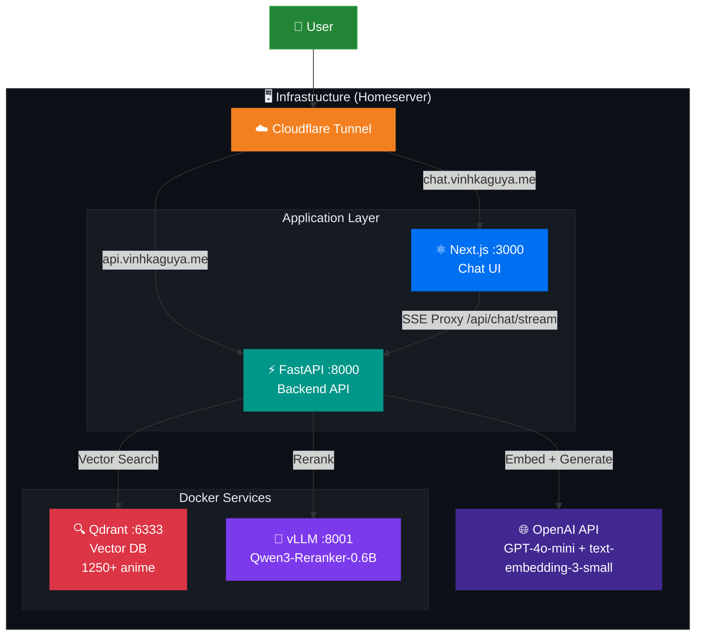
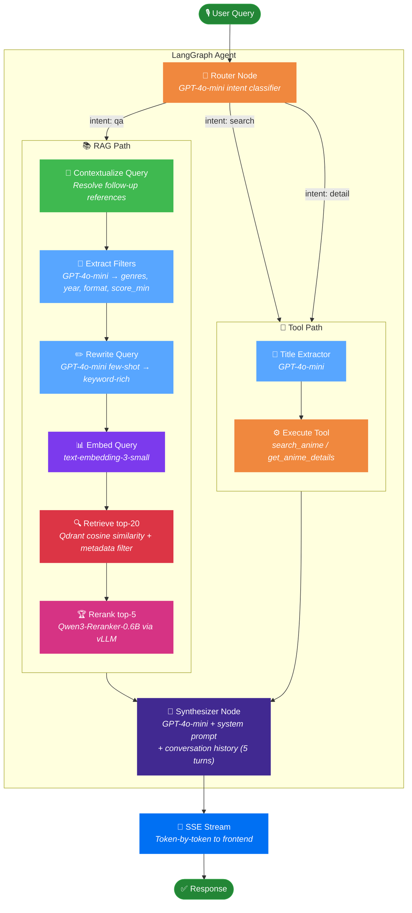
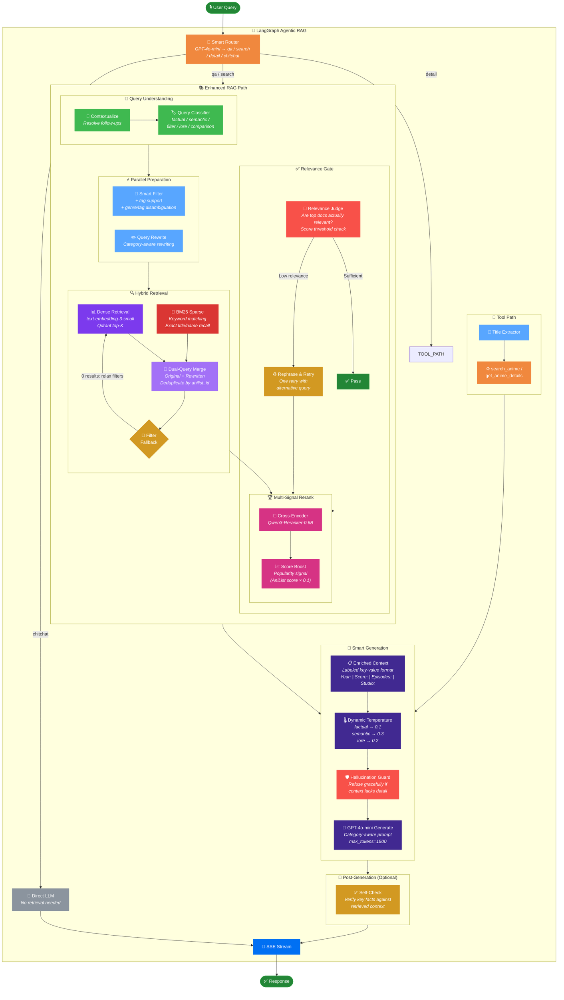
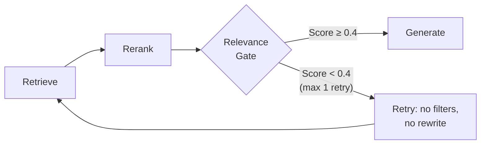
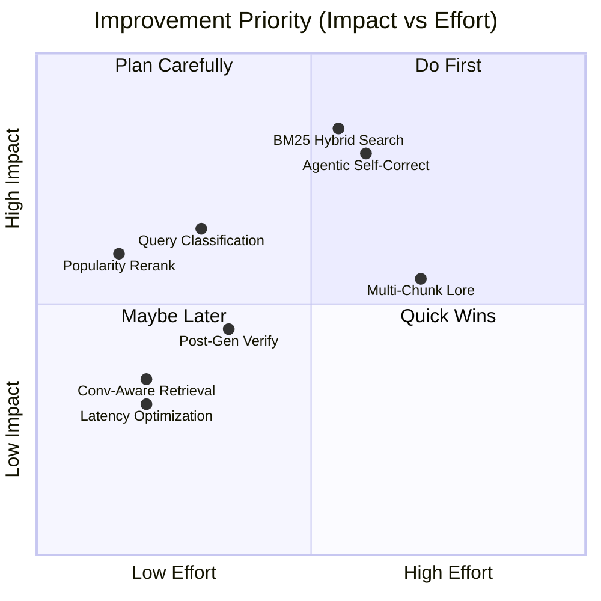

# 🎯 AniMind plan_v3 — RAG Pipeline Architecture & Improvement Roadmap

> **Phương pháp:** Kaizen (改善) — Many small improvements beat one big change.
> Each phase is a self-contained improvement that can be measured independently.

---

## 🏗️ System Architecture Overview



---

## 📐 Current RAG Pipeline (v1)



### v1 Weaknesses Identified

| Component | Problem | Evidence |
|---|---|---|
| 🔍 Single-vector retrieval | Misses keyword-exact matches ("Clannad: After Story" vs "Clannad") | q012 = **0.000** |
| 🔧 Filter extraction | No tag support, no fallback on 0 results | q029, q033 = **SKIPPED** |
| ✏️ Query rewrite | Strips intent signal, only keyword-rich output | q026 = **0.360** |
| 📝 Context format | Parenthetical `(2009, TV)` — LLM misreads metadata | q030 = **0.500** |
| 💬 Generation | Same prompt for factual/lore/recommendation | q046 = **0.429** (hallucination) |
| 📊 Synopsis | 500-char truncation, too short for lore queries | q041-q044 = **SKIPPED** |

---

## 🚀 Proposed RAG Pipeline (v3) — Full Architecture



---

## 🗺️ Improvement Roadmap — 8 Enhancement Areas

### Area 1: 🔍 Hybrid Search (BM25 + Dense Vector)

> **Priority:** 🔴 HIGH — Fixes exact-match failures (q012 Clannad: After Story)

**Problem:** Dense vector search is semantic-only. "Clannad: After Story" and "Clannad" have nearly identical embeddings, so the wrong entry gets retrieved. BM25 keyword search would score "After Story" much higher for exact title matches.

**Implementation:**
```
Option A: Qdrant built-in sparse vectors (recommended)
  - Add sparse vector (BM25/SPLADE) field to collection
  - Re-ingest with dual vectors: dense + sparse
  - Use Qdrant's hybrid search with RRF fusion

Option B: External BM25 index
  - Use rank_bm25 library or SQLite FTS5 (already have for FActScore!)
  - Query both Qdrant + BM25, merge with RRF
```

**Files:** `retriever.py`, `ingest.py`, `chain.py`
**Effort:** ~4h (Option B reuses existing FActScore SQLite)

---

### Area 2: 🤖 Agentic RAG — Self-Correcting Retrieval ✅

> **Priority:** 🔴 HIGH — Fixes SKIPPED questions and low-relevance retrievals
> **Status:** ✅ IMPLEMENTED (2026-04-24)

**Problem:** Current pipeline is a fixed sequence. If retrieval returns irrelevant docs, the LLM either hallucinates or refuses. An agentic loop can detect poor retrieval and retry.

**Implementation:**


**New LangGraph node: `relevance_gate_node`** — State machine:
```
retry_count: 0 → score >= 0.4 → PASS → synthesizer
retry_count: 0 → score <  0.4 → RETRY → {retry_count: 1} → rag_node
retry_count: 1 → score >= 0.4 → PASS → {retry_count: 2} → synthesizer
retry_count: 1 → score <  0.4 → PASS (exhausted) → {retry_count: 2} → synthesizer
```

**Retry strategy:** On retry, `rag_node` skips filter extraction and query rewriting — uses the original contextualized query with no filters for maximum recall.

**Files modified:** `state.py` (+`retry_count`, `top_rerank_score`), `nodes.py` (+`relevance_gate_node`, retry logic in `rag_node`), `graph.py` (conditional edge loop)

**Future:** Web search fallback when retry also fails (noted for later implementation).


---

### Area 3: 🏷️ Smart Query Classification

> **Priority:** 🟡 MEDIUM — Enables intent-specific optimization

**Problem:** The router classifies as `qa/search/detail` but doesn't distinguish between subtypes that need different retrieval strategies:

| Subtype | Example | Optimal Strategy |
|---|---|---|
| **factual** | "Score of Naruto?" | Exact title match → single doc → low temp |
| **semantic** | "Anime about loss and redemption" | Broad thematic search → multiple docs → high temp |
| **filter** | "Action anime from 2019" | Metadata-heavy → strict filters → list format |
| **lore** | "Explain Nen system in HxH" | Title match → long synopsis → honest refusal if shallow |
| **comparison** | "Compare AoT vs Demon Slayer" | Multi-title retrieval → side-by-side format |

**Implementation:** Extend router to output `{"intent": "qa", "subtype": "factual"}` and pass through state.

**Files:** `nodes.py` (router prompt), `state.py` (add `query_subtype`), `chain.py` (use subtype for temperature/prompt)
**Effort:** ~2h

---

### Area 4: 📊 Popularity-Weighted Reranking

> **Priority:** 🟡 MEDIUM — Fixes q026 "best sci-fi" returning niche titles

**Problem:** Reranker scores purely on semantic similarity. For "best" or "top rated" queries, popular/high-scored anime should be boosted.

**Implementation:**
```python
# After reranking, apply popularity boost for recommendation queries
if query_subtype in ("semantic", "filter"):
    for doc in top_docs:
        anilist_score = doc.payload.get("score", 0) / 100  # 0-1 range
        doc.adjusted_score = doc.rerank_score * 0.8 + anilist_score * 0.2
    top_docs.sort(key=lambda d: d.adjusted_score, reverse=True)
```

**Files:** `chain.py` or `nodes.py` (post-rerank adjustment)
**Effort:** ~1h

---

### Area 5: 📝 Multi-Chunk Strategy for Lore Depth

> **Priority:** 🟡 MEDIUM — Addresses multi_turn category (0.782)

**Problem:** Strategy 5 uses one rich chunk per anime. For titles like HxH, Berserk, AoT — the single synopsis is too shallow for lore questions.

**Options:**

```
Option A: Extended synopsis chunks (Low effort)
  - During ingestion, if AniList description > 500 chars,
    create a SECOND chunk: "lore_chunk" with full description
  - Tag it: {"chunk_type": "lore", "anilist_id": ...}
  - Retriever can prioritize lore chunks for lore-subtype queries

Option B: External enrichment (High effort, high reward)
  - Scrape MyAnimeList reviews / AniDB summaries
  - Create character-level chunks, arc-level chunks
  - Requires new ingestion pipeline
```

**Files:** `ingest.py`, `retriever.py`
**Effort:** Option A ~2h, Option B ~8h+

---

### Area 6: 🛡️ Post-Generation Fact Verification

> **Priority:** 🟢 LOW — Polish step, not a core fix

**Problem:** LLM sometimes outputs scores, years, or episode counts that don't match the retrieved context (q012, q046).

**Implementation:**
```python
async def self_check(answer: str, context_docs: list[RetrievedDoc]) -> str:
    """Quick LLM call to verify key facts in the answer match the context."""
    check_prompt = f"""
    Verify these facts in the answer match the context. Fix any mismatches.
    Context: {context_summary}
    Answer: {answer}
    Return the corrected answer only.
    """
    # One GPT-4o-mini call, ~50 tokens, adds ~200ms latency
```

**Trade-off:** +200ms latency per request, +$0.001 per query. Worth it for factual accuracy.
**Files:** `chain.py` (new function), `nodes.py` (add post-synth step)
**Effort:** ~2h

---

### Area 7: 🔄 Conversation-Aware Retrieval

> **Priority:** 🟢 LOW — Already partially implemented via `_contextualize_query`

**Current state:** Follow-up queries are rewritten with history context. But the retriever doesn't benefit from knowing what was already discussed.

**Enhancement:**
```python
# Exclude already-discussed anime from retrieval to promote diversity
seen_anilist_ids = state.get("discussed_anime_ids", set())
# Add negative filter to Qdrant: must_not = [MatchAny(key="anilist_id", any=seen_ids)]
```

**Files:** `retriever.py` (add `exclude_ids` param), `nodes.py` (track discussed IDs)
**Effort:** ~1h

---

### Area 8: ⚡ Latency Optimization

> **Priority:** 🟢 LOW — Not user-facing yet but scales poorly

**Current latency chain:**
```
contextualize(~300ms) → extract_filters(~300ms) → rewrite(~300ms)
  → embed(~200ms) → qdrant(~20ms) → rerank(~150ms) → generate(~1500ms)
Total: ~2.7s before first token
```

**Optimizations:**
```python
# Parallel step 1: run filter + rewrite concurrently
filter_task = asyncio.create_task(extract_filters(query, oai_client))
rewrite_task = asyncio.create_task(rewrite_query(query, oai_client))
filters, rewritten = await asyncio.gather(filter_task, rewrite_task)
# Saves ~300ms

# Parallel step 2: BM25 + Dense retrieval concurrently
# Saves ~20ms (BM25 is fast but runs in parallel with embedding)
```

**Files:** `chain.py` (add `asyncio.gather`), `nodes.py`
**Effort:** ~1h

---

## 📊 Improvement Priority Matrix



### Recommended Implementation Order

| Order | Area | Effort | Expected Impact |
|---|---|---|---|
| **1** | Context Format Enrichment (Phase 1 below) | 2h | +0.03 FActScore |
| **2** | Filter Fallback + Tag Support (Phase 2 below) | 2h | -3 skips |
| **3** | Popularity Rerank (Area 4) | 1h | +0.02 semantic |
| **4** | BM25 Hybrid Search (Area 1) | 4h | +0.04 factual |
| **5** | Agentic Self-Correct (Area 2) | 3h | -2 skips |
| **6** | Smart Query Classification (Area 3) | 2h | Enables areas 4-8 |
| **7** | Post-Gen Verification (Area 6) | 2h | +0.01 overall |
| **8** | Multi-Chunk Lore (Area 5) | 2-8h | +0.03 multi_turn |

**Total estimated effort:** ~18-24h across all areas.

---

## 📊 Current State — Baseline FActScore (v1)

```
Overall:   0.8787 mean  (41 evaluated / 9 skipped out of 50)
─────────────────────────────────────────────────────────
factual:     0.9333  (15/15 evaluated) ← Strong
semantic:    0.8342  (12/13 evaluated) ← Moderate
filter:      0.8920  ( 8/10 evaluated) ← Moderate, 2 skipped
multi_turn:  0.7824  ( 4/ 8 evaluated) ← Weak, 4 skipped
edge:        0.8750  ( 2/ 4 evaluated) ← 2 skipped
```

**Target:** ragv2 FActScore ≥ 0.92 overall, ≤ 3 skipped questions.

---

## 🔍 Root Cause Analysis (5 Whys per failure cluster)

### Cluster 1: Wrong/missing metadata in context (q012, q026, q030)

| Question | Score | Root Cause |
|---|---|---|
| q012 "Clannad: After Story score?" | **0.000** | LLM said 8.7/10 but KB has different value → context passage showed wrong Clannad entry (main vs After Story) |
| q026 "Best sci-fi futuristic anime?" | **0.360** | Retrieved niche sci-fi (low-rated) instead of well-known ones; reranker didn't promote popular titles |
| q030 "Highly rated anime movies >8.0" | **0.500** | Filter `format=MOVIE` + `score_min=80` too restrictive; fewer candidates → weak results |

**Why chain:** Retrieved wrong anime → because vector search is thematic, not title-exact → because query rewrite stripped specifics → because context format lacks explicit `Year:` / `Score:` labels the LLM can latch onto → because `_build_context()` uses `(2009, TV)` parenthetical format instead of labeled fields.

### Cluster 2: Multi-turn deep lore questions skipped (q041–q044)

| Question | Score | Root Cause |
|---|---|---|
| q041 "Nen power system in HxH" | SKIPPED | LLM refused — synopsis doesn't contain Nen system details |
| q042 "Significance of Titans in AoT" | SKIPPED | Synopsis too short (500ch truncation), lacks plot details |
| q043 "Spike's background in Cowboy Bebop" | SKIPPED | Same — synopsis is a teaser, not a character analysis |
| q046 "Guts/Griffith relationship, Eclipse" | **0.429** | LLM hallucinated lore details not in 500-char synopsis |

**Why chain:** Multi-turn lore questions expect **deep plot knowledge** → our KB only has 500-char synopsis truncation → because `_build_context()` truncates at 500 chars → because Strategy 5 was designed for entity retrieval, not lore retrieval → because the **data source itself** (AniList) only provides short synopses.

**Verdict:** These questions are **out of scope** for our current KB. We can mitigate (longer synopsis, better prompting) but not fully solve without adding a new data source (e.g. MyAnimeList reviews, wiki summaries). For now, **teach the LLM to decline gracefully** instead of hallucinating.

### Cluster 3: Filter extraction failures (q029, q033)

| Question | Score | Root Cause |
|---|---|---|
| q029 "Highest-rated action anime from 2019" | SKIPPED | Filter too strict (`Action` + `year=2019` + `score_min` implied) → 0 results |
| q033 "Shounen anime from 2020 with strong score" | SKIPPED | "Shounen" is a **tag** not a genre; filter extracts `genre=Shounen` → 0 results |

**Why chain:** Filter too strict → returns 0 docs → LLM says "no info" → FActScore skips → because `extract_filters()` doesn't distinguish tags from genres → because there's no fallback retry without filters when initial retrieval returns 0.

---

## 📋 Implementation Phases

### Phase 0 — Bugfix (pre-requisite, 15 min)

> **CRITICAL:** `evaluate.py` line 43 imports `run_factscore_eval` but the function is named `run_factscore`. This crashes the orchestrator.

| Task | File | Change |
|---|---|---|
| Fix import name | `eval/evaluate.py:43` | `run_factscore_eval` → `run_factscore` |

---

### Phase 1 — Context Format Enrichment (2h)

> **Kaizen pillar:** Poka-Yoke — make it impossible for the LLM to miss metadata.
> **Impact:** Fixes q012, q030, improves all factual/filter categories.

#### 1.1 Explicit labeled context format

**Current** `_build_context()` in `chain.py:293`:
```
[1] **Fullmetal Alchemist: Brotherhood** (2009, TV) | Score: 9.0/10 | Genres: Action, Adventure
Two brothers use alchemy to search for the Philosopher's Stone...
```

**New format** (structured key-value, explicit labels):
```
[1] FULLMETAL ALCHEMIST: BROTHERHOOD
    Year: 2009 | Format: TV | Score: 9.0/10 | Episodes: 64
    Genres: Action, Adventure, Drama, Fantasy
    Studio: bones
    Synopsis: Two brothers use alchemy to search for the Philosopher's Stone...
```

**Why labeled:** FActScore baseline shows the LLM misreads parenthetical `(2009, TV)` as decorative. Explicit `Year:`, `Format:`, `Studio:` labels are unambiguous and match the KB format used in FActScore verification.

**File:** `backend/app/rag/chain.py` → `_build_context()`
**File:** `backend/eval/collect.py` → `_doc_to_eval_context()`

#### 1.2 Increase synopsis truncation 500 → 800 chars

**Current:** `chain.py:322` truncates at `[:500]`
**Change:** `[:800]` — still within reranker's 512-token limit for the combined query+doc, but gives the LLM more context for lore questions.

**File:** `backend/app/rag/chain.py:322`

#### 1.3 Increase max_tokens 900 → 1500

**Current:** `chain.py:437` uses `max_tokens=900`
**Why:** Short answers produce fewer atomic facts → lower FActScore for recommendation/list questions (q022, q026).
The eval collect.py already uses 1500. Production pipeline should match.

**File:** `backend/app/rag/chain.py:437` and `:452`

#### 1.4 Add episodes + studio to context header

**Current:** `_build_context()` only shows title, year, format, score, genres.
**Missing:** Episodes, studio, status — all commonly asked factual fields.

**Files:** `backend/app/rag/chain.py` → `_build_context()`

---

### Phase 2 — Retrieval Quality (3h)

> **Kaizen pillar:** Continuous Improvement — targeted fixes to the weakest retrieval patterns.
> **Impact:** Fixes q029, q033 (filter failures), improves q026 (poor semantic retrieval).

#### 2.1 Filter fallback: retry without filters on empty results

**Problem:** When `genres=["Action"], year=2019, score_min=80` returns 0 docs, the pipeline returns "no info" instead of trying without the most restrictive filter.

**Solution:** Cascading filter relaxation in `rag_answer()`:
```python
# Attempt 1: full filters
docs = await retrieve(query, oai_client, top_k=20, filter_kwargs=filter_kwargs)

# Attempt 2: drop score_min (most restrictive)
if not docs and filter_kwargs and "score_min" in filter_kwargs:
    relaxed = {k: v for k, v in filter_kwargs.items() if k != "score_min"}
    docs = await retrieve(query, oai_client, top_k=20, filter_kwargs=relaxed or None)

# Attempt 3: no filters at all
if not docs and filter_kwargs:
    docs = await retrieve(query, oai_client, top_k=20, filter_kwargs=None)
```

**File:** `backend/app/rag/chain.py` → `rag_answer()`

#### 2.2 Tags vs genres disambiguation in filter extraction

**Problem:** q033 "Shounen anime from 2020" — `Shounen` is an AniList **tag**, not a genre. Filter extraction puts it in `genres=["Shounen"]` → Qdrant returns 0 results because genres don't contain "Shounen".

**Solution:** Add tag awareness to `_FILTER_EXTRACTION_PROMPT`:
```
Note: "shounen", "seinen", "josei", "shoujo", "isekai", "mecha" are TAGS, not genres.
If the user mentions these, add them as "tags": ["Shounen"] (not genres).
```

And update `FilterParams` + `build_filter()` to support tag matching:
```python
@dataclass
class FilterParams:
    ...
    tags: list[str] = field(default_factory=list)  # NEW
```

**Files:**
- `backend/app/rag/chain.py` → `FilterParams`, `_FILTER_EXTRACTION_PROMPT`, `extract_filters()`
- `backend/app/rag/retriever.py` → `build_filter()` (add `tags` MatchAny condition)

#### 2.3 Dual-query retrieval for semantic questions

**Problem:** q026 "Best sci-fi futuristic anime" — the rewritten query becomes keyword-like "sci-fi futuristic cyberpunk space" which retrieves niche entries. The original query "best anime for fans of sci-fi" implies popularity, but the vector search ignores that.

**Solution:** For semantic/recommendation questions, retrieve using **both** the rewritten query AND the original query, then merge + deduplicate before reranking:
```python
# Retrieve with rewritten query (thematic keywords)
docs_rewritten = await retrieve(rewritten, oai_client, top_k=15, filter_kwargs=filter_kwargs)

# Retrieve with original query (captures intent + popularity signal)
docs_original = await retrieve(question, oai_client, top_k=10, filter_kwargs=filter_kwargs)

# Merge + deduplicate by anilist_id, keep highest score
seen_ids = set()
merged = []
for doc in docs_rewritten + docs_original:
    aid = doc.payload.get("anilist_id")
    if aid not in seen_ids:
        seen_ids.add(aid)
        merged.append(doc)

# Rerank merged pool → top-5
```

**File:** `backend/app/rag/chain.py` → `rag_answer()` (add dual-query logic)
**File:** `backend/eval/collect.py` → `run_ragv2()` (same logic)

#### 2.4 Increase retriever top-k: 20 → 30

**Rationale:** With dual-query, the merged pool can have up to ~25 unique docs. Reranker still selects top-5. More candidates → better rerank precision. Cost: one extra Qdrant query (negligible latency, ~20ms).

**File:** `backend/app/config.py` or inline in ragv2 pipeline

---

### Phase 3 — Generation Quality (2h)

> **Kaizen pillar:** Standardized Work — consistent prompting patterns.
> **Impact:** Reduces hallucination (q046), improves multi-turn responses.

#### 3.1 Category-aware system prompt

**Problem:** The same system prompt handles factual ("How many episodes?"), semantic ("Recommend something like AoT"), and lore ("Explain the Nen system") questions. Each needs different response strategy.

**Solution:** Add a lightweight intent hint to the user message (not the system prompt, to preserve prefix caching):
```python
user_message = (
    f"Context passages:\n\n{context}\n\n"
    f"---\n\n"
    f"Query type: {intent_hint}\n"  # "factual" | "recommendation" | "analysis"
    f"User question: {query}"
)
```

The intent is already classified by the router node. Pass it through.

**File:** `backend/app/rag/chain.py` → `rag_answer()` (add `intent_hint` param)
**File:** `backend/app/agent/nodes.py` → `rag_node()` (pass intent to chain)

#### 3.2 Hallucination guard for lore questions

**Problem:** q046 Berserk — LLM fabricated Eclipse details not in synopsis (score 0.429).

**Solution:** Strengthen the system prompt's refusal rule specifically for detailed plot analysis:
```
If the user asks about specific plot events, character relationships, or lore mechanics
that are NOT mentioned in the context passages, respond with:
"Based on the synopsis in my database, [general description]. For detailed plot analysis
and specific events, I'd recommend checking dedicated anime wikis or forums."
```

This turns a hallucination (0.429) into a graceful refusal (skipped but honest).

**File:** `backend/app/rag/chain.py` → `_SYSTEM_PROMPT`

#### 3.3 Increase temperature 0.3 → 0.1 for factual questions

**Rationale:** Factual questions (score, episodes, year) need deterministic output. Lower temperature reduces LLM "creativity" that introduces wrong numbers.

**Implementation:** Use `intent_hint` to dynamically set temperature:
```python
temp = 0.1 if intent_hint == "factual" else 0.3
```

**File:** `backend/app/rag/chain.py` → `rag_answer()`

---

### Phase 4 — Eval Pipeline ragv2 Registration (1h)

> **Kaizen pillar:** JIT — build only what's needed to measure.

#### 4.1 Implement `run_ragv2()` in collect.py

```python
async def run_ragv2(
    question: str,
    oai_client: AsyncOpenAI,
) -> tuple[str, list[str], list[RetrievedDoc]]:
    """RAGv2: dual-query + filter fallback + enriched context + category-aware generation."""
    # 1. Extract filters with tag support
    filter_params = await extract_filters(question, oai_client)
    filter_kwargs = filter_params.to_dict() if not filter_params.is_empty() else None

    # 2. Rewrite query
    rewritten = await rewrite_query(question, oai_client)

    # 3. Dual-query retrieval with filter fallback
    docs = await _dual_retrieve(question, rewritten, oai_client, filter_kwargs)

    if not docs:
        return "I couldn't find any relevant anime for your query.", [], []

    # 4. Rerank → top-5
    doc_texts = [doc.chunk_text for doc in docs]
    ranked = await rerank(query=rewritten, documents=doc_texts, top_k=5)
    top_docs = [docs[r["index"]] for r in ranked]

    # 5. Generate with enriched context
    answer = await _generate_answer(question, top_docs, oai_client)
    contexts = [_doc_to_eval_context(doc) for doc in top_docs]
    return answer, contexts, top_docs
```

#### 4.2 Register in PIPELINE_REGISTRY

```python
PIPELINE_REGISTRY: dict[str, Any] = {
    "baseline": run_baseline,
    "ragv1":    run_ragv1,
    "ragv2":    run_ragv2,   # ← NEW
}
```

#### 4.3 Run full evaluation

```bash
# Collect ragv2 outputs
conda run -n animind python eval/collect.py --pipeline ragv2

# FActScore
conda run -n factscore python eval/factscore_runner.py \
  --input eval/results/raw_ragv2.json \
  --output eval/results/factscore_ragv2_v1.json \
  --db eval/factscore_db/anime_kb.db --judge-model gpt-4o-mini --gamma 0

# RAGAS comparison (after fixing import bug)
conda run -n animind python eval/evaluate.py --tag v2
```

---

### Phase 5 — Measure & Iterate (PDCA checkpoint)

> **Plan-Do-Check-Act:** After ragv2 eval, compare per-category.

#### Expected improvement targets

| Category | Baseline | ragv2 Target | Key Improvements |
|---|---|---|---|
| factual | 0.933 | ≥ 0.97 | Explicit metadata labels, lower temperature |
| semantic | 0.834 | ≥ 0.90 | Dual-query retrieval, better reranking pool |
| filter | 0.892 | ≥ 0.95 | Filter fallback, tag support |
| multi_turn | 0.782 | ≥ 0.85 | Longer synopsis, hallucination guard |
| edge | 0.875 | ≥ 0.90 | Better refusal prompting |
| **overall** | **0.879** | **≥ 0.92** | — |
| skipped | 9 | ≤ 3 | Filter fallback, graceful refusal |

#### Decision gate

After ragv2 eval completes:
- If overall ≥ 0.92 → merge ragv2 into production `chain.py`
- If overall < 0.92 → analyze remaining failures → design targeted Phase 6
- If any category regresses → revert that specific change, keep others

---

## 🚫 NOT in scope (YAGNI — Just-In-Time)

These are deferred until ragv2 results prove they're needed:

| Idea | Why deferred |
|---|---|
| Hybrid search (BM25 + dense) | Reranker already compensates; add complexity only if retrieval quality is still the bottleneck after Phase 2 |
| Multi-chunk per anime | Strategy 5 single-chunk works well for entity retrieval; only split if lore questions remain low |
| External data sources (MAL, wiki) | Requires new ingestion pipeline; only if multi_turn stays below 0.85 |
| Fine-tuned embeddings | text-embedding-3-small is good enough; only if vector recall is measured as bottleneck |
| Agentic self-reflection loop | Over-engineering for current scale; only if FActScore plateaus at ~0.92 |

---

## 📁 Files Modified

```
backend/
├── app/rag/
│   ├── chain.py         # Context format, dual-query, filter fallback, temp tuning
│   └── retriever.py     # Tag filter support in build_filter()
├── app/agent/
│   └── nodes.py         # Pass intent to rag_answer()
├── app/config.py        # (optional) retriever_top_k 20→30
├── eval/
│   ├── collect.py       # run_ragv2() + register
│   └── evaluate.py      # Fix import bug (Phase 0)
```

---

## ⏱️ Time Estimate

| Phase | Time | Dependency |
|---|---|---|
| Phase 0 — Bugfix | 15 min | None |
| Phase 1 — Context format | 2h | Phase 0 |
| Phase 2 — Retrieval quality | 3h | Phase 0 |
| Phase 3 — Generation quality | 2h | Phase 1 |
| Phase 4 — ragv2 registration + eval | 1h code + ~25 min eval run | Phase 1–3 |
| Phase 5 — Analysis + iterate | 1h | Phase 4 results |
| **Total** | **~9h + 25 min eval** | — |

---

## 📊 Decision Log

| Decision | Rationale |
|---|---|
| Labeled context > parenthetical | FActScore shows LLM misreads `(2009, TV)` — explicit `Year: 2009` is unambiguous |
| Dual-query > single rewrite | Rewrite strips intent signal; dual-query preserves both thematic + intent vectors |
| Filter fallback > strict fail | 2/50 questions return 0 docs due to over-filtering; cascading relaxation is cheap |
| Tag support in filters | "Shounen" is a tag, not genre — current system maps it wrong → 0 results |
| Graceful refusal > hallucination | Skipped (honest) is better than 0.429 score (fabricated). FActScore penalizes hallucination harder than refusal |
| Temperature tuning by intent | Factual questions need determinism (0.1); recommendations need creativity (0.3) |
| Synopsis 500→800 not 500→unlimited | Stay within reranker's 512-token limit; 800 chars ≈ 200 tokens, safe margin |
| NOT adding hybrid search yet | Kaizen: measure first, optimize second. Reranker already compensates for vector-only recall gaps |
